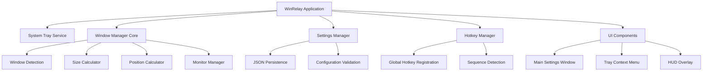
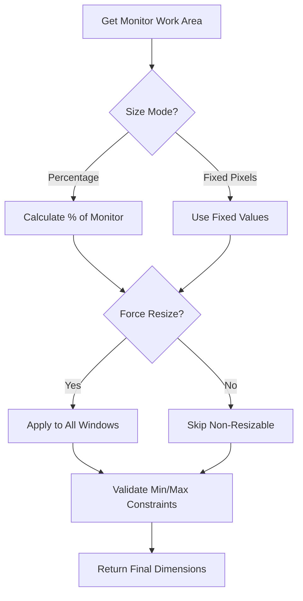
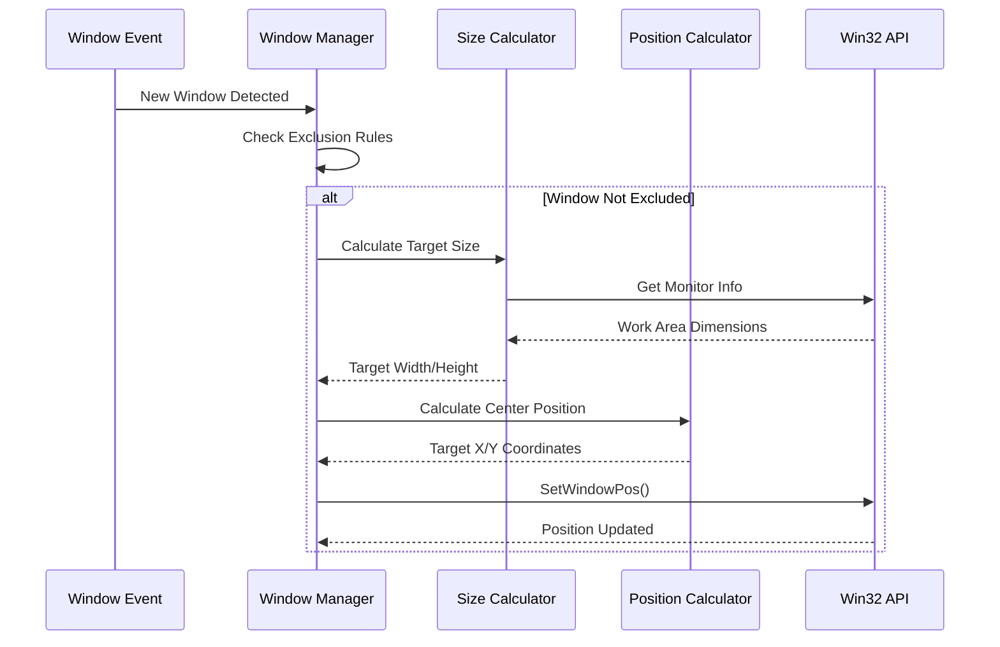
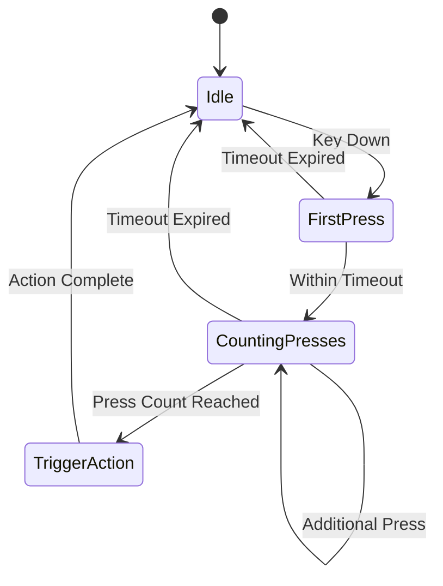
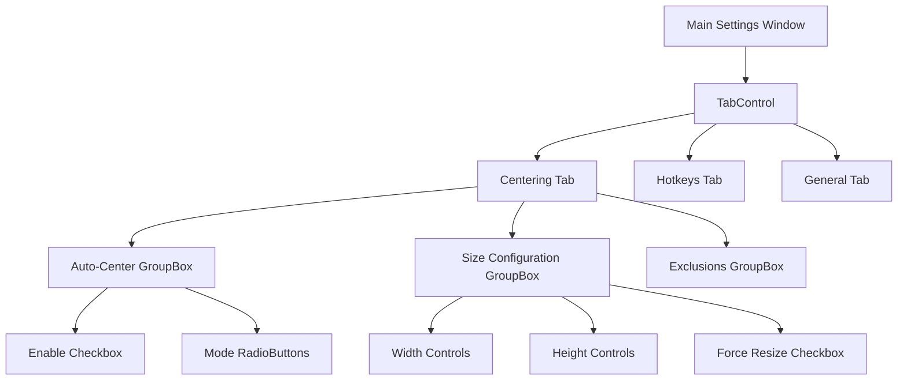
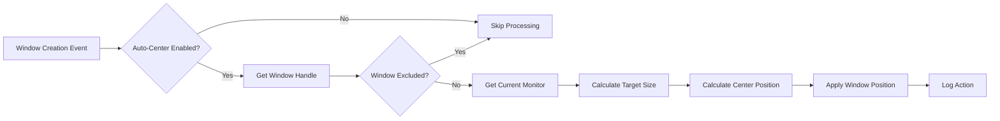
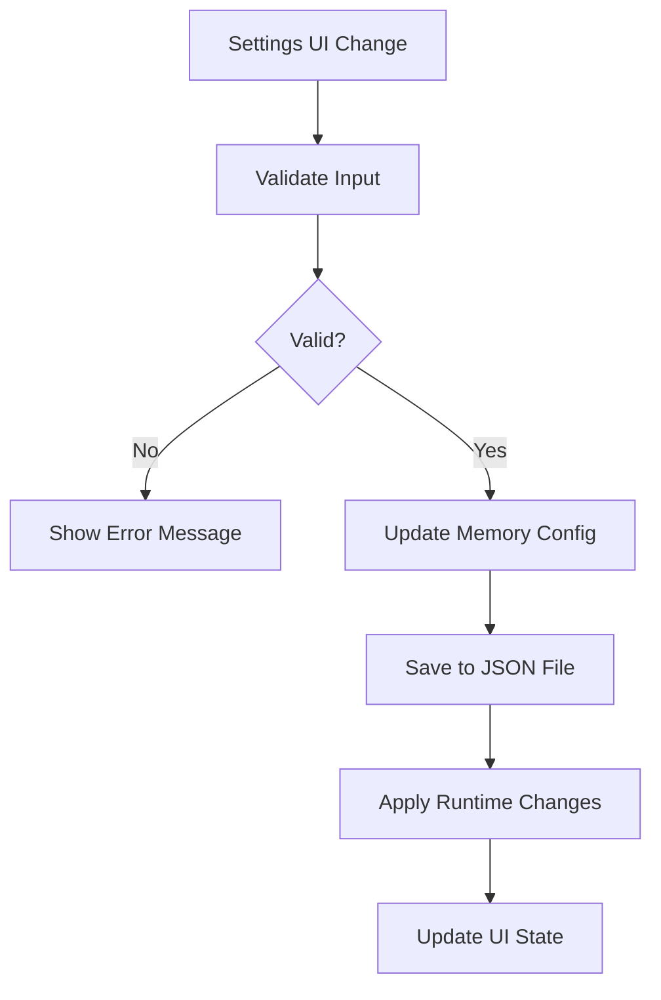

# Multi-Display Window Manager - Width Resizing Feature Design

## Overview

The Multi-Display Window Manager (WinRelay) is a lightweight Windows desktop utility designed to improve window management across single and multiple displays. This design document focuses on the width resizing functionality as part of the broader window management system. The application leverages Win32 APIs for robust window manipulation while maintaining a clean, tabbed settings interface and system tray integration.

### Core Objectives
- Provide intelligent window centering with configurable width/height control
- Enable both automatic and manual window positioning
- Support percentage-based and pixel-based sizing options
- Maintain compatibility across multiple monitor configurations
- Ensure minimal system resource usage with tray-based operation

## Technology Stack & Dependencies

### Primary Framework
- **C# WinForms** with .NET 6.0
- **Win32 API** integration via P/Invoke
- **JSON** configuration storage
- **System Tray** integration using NotifyIcon

### Key Dependencies
- System.Windows.Forms (WinForms UI)
- System.Text.Json (Settings persistence)
- Microsoft.Win32 (Registry operations)
- User32.dll (Win32 API calls)

### Target Platform
- Windows x64 single-file executable
- .NET 6.0 runtime (self-contained deployment)

## Architecture

### Application Structure



### Core Components

#### 1. Window Manager Core
**Purpose**: Central engine for window manipulation and sizing logic

**Key Responsibilities**:
- Window detection and tracking
- Size calculation (percentage vs pixel-based)
- Position calculation for centering
- Monitor boundary detection
- Exclusion rule processing

**Win32 API Integration**:
```csharp
// Core window manipulation APIs
GetForegroundWindow() -> IntPtr
GetWindowRect(IntPtr hWnd, out RECT rect) -> bool
SetWindowPos(IntPtr hWnd, IntPtr hWndInsertAfter, int x, int y, int width, int height, uint flags) -> bool
MonitorFromWindow(IntPtr hWnd, uint flags) -> IntPtr
GetMonitorInfo(IntPtr hMonitor, ref MONITORINFO info) -> bool
EnumDisplayMonitors(IntPtr hdc, IntPtr lprcClip, MonitorEnumProc lpfnEnum, IntPtr dwData) -> bool
```

#### 2. Size Calculator Service
**Purpose**: Calculate window dimensions based on user preferences

**Configuration Options**:
- **Width Control**: Percentage (e.g., 88%) or Fixed Pixels (e.g., 1280)
- **Height Control**: Percentage (e.g., 75%) or Fixed Pixels (e.g., 800)
- **Force Resize**: Toggle for non-resizable windows
- **Aspect Ratio Preservation**: Optional constraint

**Calculation Logic**:


#### 3. Window Detection Engine
**Purpose**: Identify and track window creation events

**Detection Methods**:
- **Hook-based Detection**: SetWinEventHook for EVENT_OBJECT_CREATE
- **Polling Method**: Fallback timer-based window enumeration
- **Foreground Window Monitoring**: Track active window changes

**Exclusion System**:
- Process name exclusions
- Window title pattern matching
- Window class exclusions
- Interactive exclusion prompts

#### 4. Monitor Manager
**Purpose**: Handle multi-monitor configurations and coordinate systems

**Key Features**:
- Monitor enumeration and caching
- DPI awareness handling
- Primary vs secondary monitor detection
- Virtual desktop coordinate mapping

## Component Architecture

### Window Centering Component

#### Properties and Configuration
```csharp
public class WindowCenteringConfig
{
    public bool AutoCenterEnabled { get; set; }
    public bool HotkeyTriggerEnabled { get; set; }
    public SizeMode WidthMode { get; set; } // Percentage or Pixels
    public SizeMode HeightMode { get; set; }
    public double WidthValue { get; set; }
    public double HeightValue { get; set; }
    public bool ForceResize { get; set; }
    public List<string> ExcludedProcesses { get; set; }
    public HotkeySequence TriggerSequence { get; set; }
}

public enum SizeMode
{
    Percentage,
    FixedPixels
}
```

#### Core Window Centering Logic


### Hotkey Management Component

#### Hotkey Configuration
```csharp
public class HotkeySequence
{
    public ModifierKeys TriggerKey { get; set; } // Shift, Ctrl, Alt
    public int PressCount { get; set; } // Number of consecutive presses
    public int TimeoutMs { get; set; } // Maximum time between presses
    public bool GlobalScope { get; set; } // System-wide vs app-specific
}
```

#### Sequence Detection Algorithm


### Settings Management Component

#### Configuration Persistence
```csharp
public class ApplicationSettings
{
    public WindowCenteringConfig WindowCentering { get; set; }
    public HotkeyConfig Hotkeys { get; set; }
    public UIConfig UserInterface { get; set; }
    public StartupConfig Startup { get; set; }
    
    // Persistence methods
    public void SaveToFile(string path);
    public static ApplicationSettings LoadFromFile(string path);
}
```

#### Storage Location
- **Path**: `%LOCALAPPDATA%\WinRelay\settings.json`
- **Format**: JSON with validation
- **Backup**: Automatic backup on successful save
- **Migration**: Version-aware configuration updates

## UI Architecture

### Main Settings Window
**Technology**: WinForms TabControl with custom styling

#### Tab Structure
1. **Window Centering Tab**
   - Auto-center toggle
   - Size configuration (width/height)
   - Mode selection (percentage/pixels)
   - Force resize option
   - Exclusion list management

2. **Hotkeys Tab**
   - Hotkey sequence configuration
   - Global hotkey assignments
   - Trigger key selection
   - Timeout settings

3. **General Settings Tab**
   - Startup behavior
   - Theme selection
   - Language preferences
   - Update checking

#### Control Layout


### System Tray Integration
**Component**: NotifyIcon with context menu

#### Tray Menu Structure
```
WinRelay
├── Center Active Window
├── ──────────────────
├── Enable Auto-Center
├── Settings...
├── ──────────────────
├── About
└── Exit
```

#### Tray Behavior
- **Double-click**: Restore settings window
- **Right-click**: Show context menu
- **Minimize to tray**: Hide from taskbar
- **Startup**: Start minimized to tray

## Data Flow Architecture

### Window Processing Pipeline



### Configuration Flow



## Middleware & Interceptors

### Window Event Monitoring
**Implementation**: Win32 SetWinEventHook for real-time window events

```csharp
public class WindowEventMonitor
{
    private WinEventDelegate _windowEventDelegate;
    private IntPtr _hookHandle;
    
    public void StartMonitoring()
    {
        _windowEventDelegate = new WinEventDelegate(WindowEventCallback);
        _hookHandle = SetWinEventHook(
            EVENT_OBJECT_CREATE,
            EVENT_OBJECT_CREATE,
            IntPtr.Zero,
            _windowEventDelegate,
            0, 0,
            WINEVENT_OUTOFCONTEXT | WINEVENT_SKIPOWNPROCESS);
    }
    
    private void WindowEventCallback(IntPtr hWinEventHook, uint eventType, 
        IntPtr hwnd, int idObject, int idChild, uint dwEventThread, uint dwmsEventTime)
    {
        // Process window creation events
        if (eventType == EVENT_OBJECT_CREATE && hwnd != IntPtr.Zero)
        {
            WindowManager.ProcessNewWindow(hwnd);
        }
    }
}
```

### Global Hotkey Interceptor
**Implementation**: RegisterHotKey API with message loop integration

```csharp
public class HotkeyInterceptor
{
    private Dictionary<int, HotkeyAction> _registeredHotkeys;
    
    public bool RegisterSequenceHotkey(HotkeySequence sequence, HotkeyAction action)
    {
        // Register with Windows hotkey system
        int hotkeyId = GetNextHotkeyId();
        bool success = RegisterHotKey(Handle, hotkeyId, 
            (uint)sequence.Modifiers, (uint)sequence.Key);
            
        if (success)
        {
            _registeredHotkeys[hotkeyId] = action;
        }
        
        return success;
    }
    
    protected override void WndProc(ref Message m)
    {
        if (m.Msg == WM_HOTKEY)
        {
            int hotkeyId = m.WParam.ToInt32();
            if (_registeredHotkeys.ContainsKey(hotkeyId))
            {
                _registeredHotkeys[hotkeyId].Execute();
            }
        }
        base.WndProc(ref m);
    }
}
```

## Testing Strategy

### Unit Testing Framework
**Technology**: MSTest with Moq for mocking

#### Test Categories

1. **Size Calculation Tests**
   ```csharp
   [TestClass]
   public class SizeCalculatorTests
   {
       [TestMethod]
       public void CalculatePercentageWidth_ReturnsCorrectPixels()
       {
           var calculator = new SizeCalculator();
           var result = calculator.CalculateWidth(1920, 0.8, SizeMode.Percentage);
           Assert.AreEqual(1536, result);
       }
       
       [TestMethod]
       public void CalculateFixedWidth_ReturnsExactPixels()
       {
           var calculator = new SizeCalculator();
           var result = calculator.CalculateWidth(1920, 1280, SizeMode.FixedPixels);
           Assert.AreEqual(1280, result);
       }
   }
   ```

2. **Window Detection Tests**
   ```csharp
   [TestClass]
   public class WindowDetectionTests
   {
       [TestMethod]
       public void IsWindowExcluded_ProcessInExclusionList_ReturnsTrue()
       {
           var config = new WindowCenteringConfig
           {
               ExcludedProcesses = new List<string> { "notepad.exe" }
           };
           var detector = new WindowDetector(config);
           
           bool result = detector.IsWindowExcluded("notepad.exe", "Untitled - Notepad");
           Assert.IsTrue(result);
       }
   }
   ```

3. **Monitor Management Tests**
   ```csharp
   [TestClass]
   public class MonitorManagerTests
   {
       [TestMethod]
       public void GetPrimaryMonitor_ReturnsValidMonitorInfo()
       {
           var manager = new MonitorManager();
           var primary = manager.GetPrimaryMonitor();
           
           Assert.IsNotNull(primary);
           Assert.IsTrue(primary.IsPrimary);
           Assert.IsTrue(primary.WorkArea.Width > 0);
           Assert.IsTrue(primary.WorkArea.Height > 0);
       }
   }
   ```

### Integration Testing

#### Window Manipulation Integration
```csharp
[TestClass]
public class WindowManipulationIntegrationTests
{
    [TestMethod]
    public void CenterWindow_ValidWindow_PositionsCorrectly()
    {
        // Create test window
        var testWindow = CreateTestWindow();
        var manager = new WindowManager(GetTestConfig());
        
        // Center the window
        manager.CenterWindow(testWindow.Handle);
        
        // Verify position
        var rect = GetWindowRect(testWindow.Handle);
        var monitor = GetMonitorFromWindow(testWindow.Handle);
        
        var expectedX = (monitor.WorkArea.Width - rect.Width) / 2;
        var expectedY = (monitor.WorkArea.Height - rect.Height) / 2;
        
        Assert.AreEqual(expectedX, rect.X, 5); // 5px tolerance
        Assert.AreEqual(expectedY, rect.Y, 5);
    }
}
```

### Test Data Management
- **Mock window data** for unit tests
- **Test configuration files** for different scenarios
- **Automated UI testing** for settings dialogs
- **Performance benchmarks** for window processing speed

### Test Coverage Goals
- **Unit Tests**: 90%+ coverage for core logic
- **Integration Tests**: Critical Win32 API interactions
- **UI Tests**: Settings persistence and validation
- **Performance Tests**: Window processing latency < 100ms

## Implementation Architecture

### Application Entry Point
```csharp
[STAThread]
static void Main()
{
    // Single instance enforcement using named Mutex
    using var mutex = new Mutex(true, "WinRelay_SingleInstance", out bool isNewInstance);
    if (!isNewInstance) return;
    
    Application.EnableVisualStyles();
    Application.SetCompatibleTextRenderingDefault(false);
    
    var app = new WinRelayApplication();
    app.Initialize();
    Application.Run();
}
```

### Core Service Architecture
```csharp
public class WinRelayApplication
{
    private TrayManager _trayManager;
    private WindowManager _windowManager;
    private SettingsManager _settingsManager;
    private HotkeyManager _hotkeyManager;
    
    public void Initialize()
    {
        _settingsManager = new SettingsManager();
        _windowManager = new WindowManager(_settingsManager.Config);
        _hotkeyManager = new HotkeyManager(_windowManager);
        _trayManager = new TrayManager(_settingsManager, _windowManager);
        
        _windowManager.StartMonitoring();
        _hotkeyManager.RegisterGlobalHotkeys();
        _trayManager.Initialize();
    }
}
```

### Window Manager Implementation
```csharp
public class WindowManager
{
    private WindowEventMonitor _eventMonitor;
    private SizeCalculator _sizeCalculator;
    private MonitorManager _monitorManager;
    private WindowCenteringConfig _config;
    
    public void ProcessNewWindow(IntPtr hwnd)
    {
        if (!ShouldProcessWindow(hwnd)) return;
        
        var monitor = _monitorManager.GetMonitorFromWindow(hwnd);
        var targetSize = _sizeCalculator.CalculateTargetSize(monitor, _config);
        var centerPos = CalculateCenterPosition(monitor, targetSize);
        
        SetWindowPos(hwnd, IntPtr.Zero, centerPos.X, centerPos.Y, 
                    targetSize.Width, targetSize.Height, SWP_NOZORDER);
    }
}
```